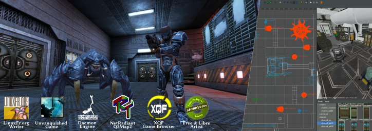

**Free open source software developer and libre open artist, committed actor of the community.**

Project head of the [Unvanquished game](https://unvanquished.net/) and [Daemon game engine](https://github.com/DaemonEngine/Daemon) maintainer of the [NetRadiant](https://netradiant.gitlab.io) and Q3map2 3D game level authoring suite, maintainer of the [XQF game server browser](https://github.com/XQF/xqf), and author of [Urcheon](https://github.com/DaemonEngine/Urcheon), a game artistic asset builder and packaging suite. I'm also a writer at [LinuxFr.org](https://linuxfr.org/users/illwieckz).

See also my [GitLab profile](https://gitlab.com/illwieckz), and other profiles on [freedesktop.org](https://gitlab.freedesktop.org/illwieckz), [GNOME](https://gitlab.gnome.org/), [Debian](https://salsa.debian.org/illwieckz) and [Jami](https://git.jami.net/illwieckz).

 